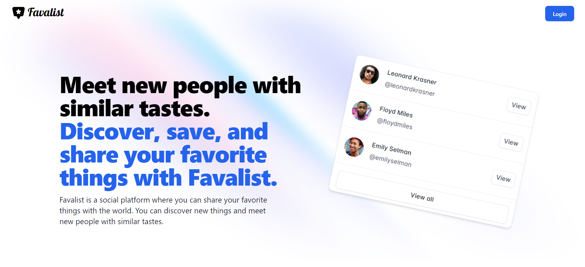
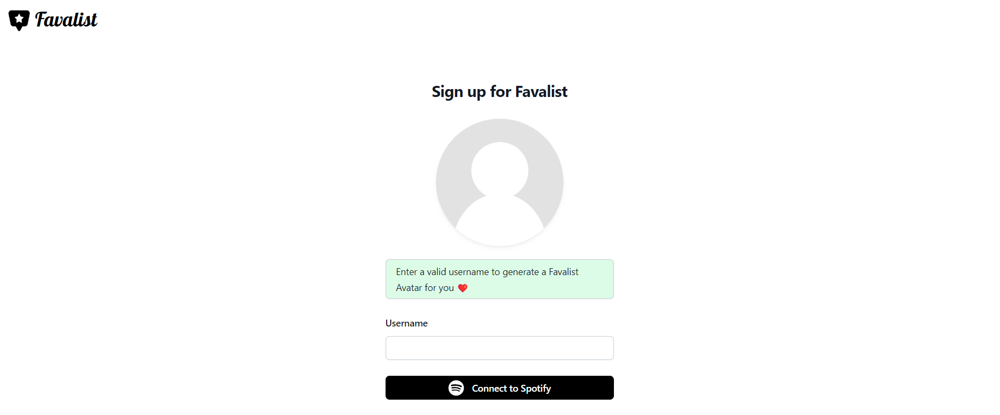

# Favalist




Favalist is an open-source social platform where you can share your favorite things with the world. You can discover new things and meet new people with similar tastes. This project was created using [Express JS](https://expressjs.com/) and
 <p align="center">
  <a href="#">
    
  </a>
</p>

## Running the server

+ Before running the server, make sure to read the [Prerequisites](#Prerequisites). 
+ In the project directory, you can run:

```bash
npm run start
```
Open http://localhost:3000 to view it in your browser.



## Prerequisites

+ You need node.js (https://nodejs.org/en/download) and MongoDB installed in your system. 
+ Register a new application in Spotify Developer Portal (https://developer.spotify.com/) and copy your client id and secret. 

+ Make sure to install all the required modules before running the server. 
  + Navigate to the project's directory. 
  + Once you're in the project's directory, you should see a file named [package.json](package.json). 
  + This file contains a list of all the dependencies (modules) required for the project. 
  + Run the following command to install all the modules listed in the package.json file. 

```bash
npm install
```

+ Create an .env file in the root of the project. This env file holds all the app tokens and secrets used by the project.

```text
MONGO_URI = "" 
SESSION_SECRET = "" #can be anything
SPOTIFY_CLIENT_ID = ""
SPOTIFY_CLIENT_SECRET = ""
```


